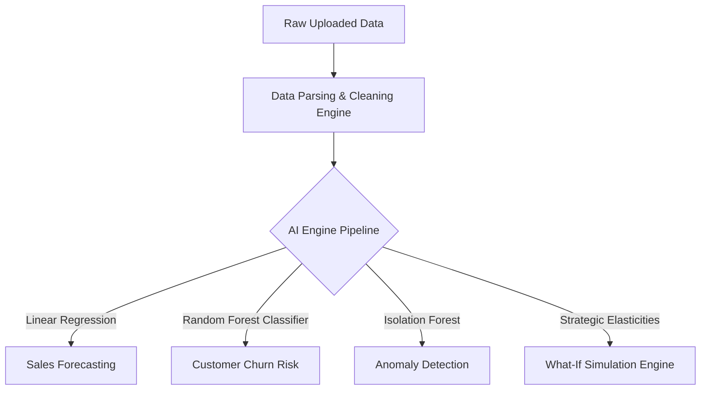

# AI-Integrated Management Consulting Framework (AIMCF) — Current Feature Inventory

This document provides a highly detailed, professional, and comprehensive catalog of the technical architecture and features implemented within the **AI-Integrated Management Consulting Framework (AIMCF)**. 

---

## 🏗️ Core Architectural Design

AIMCF is a production-ready, full-stack enterprise SaaS platform built with modern technologies, advanced predictive analytics, and premium styling.

* **Frontend Architecture:** Single Page Application (SPA) utilizing **React.js 18+**, **TypeScript**, **Material UI (MUI)** for the presentation layer, **Redux Toolkit** for unified state management, and **Recharts** for premium, fluid glassmorphic dataviz.
* **Backend Architecture:** A robust Python application powered by **Django REST Framework (DRF)**. High-performance computing tasks, data cleaning, and statistical machine learning pipelines are run asynchronously in pure Python.
* **Database & Fallback Tier:** **MySQL 8.0** is configured for enterprise deployments, with a fully automatic **SQLite fallback** (`db.sqlite3`) for zero-dependency local setup.
* **Premium UX Design:** Dark mode by default, styled with vibrant cohesive colors, custom HSL styling tokens, glassmorphism (`backdrop-filter: blur`), subtle micro-animations on interactive states, and fully responsive multi-device layouts.
* **Role-Based Access Control (RBAC):** Built-in security layers classifying users into **Admin**, **Consultant**, and **Client Representative** tiers, restricting model visibility and API route access.

---

## 🧠 Deep-Dive: Core Features

### 1. Data Parsing & Cleaning Engine
Implemented in `backend/data_engine/`, this component processes messy, raw uploaded files and normalizes them for downstream machine learning inputs.
* **Supported File Types:** CSV (`.csv`), Excel (`.xlsx`), JSON (`.json`), and raw PDF documents (`.pdf`).
* **Zero-Dependency PDF Reader:** Utilizes regular expressions on binary streams to match text paragraphs (`\(.*?\)\s*Tj`) with structural fallback decoding. If text cannot be found, it generates a clean dummy client review dataset.
* **Rigorous Cleaning Sequence:**
  1. **Column Sanitization:** Renames all columns by stripping leading/trailing spaces, converting to lowercase, and replacing all non-alphanumeric characters with underscores (`_`).
  2. **Row Deduplication:** Finds and eliminates duplicate records.
  3. **Null Handling:** Intelligently cleans missing data. Text columns are filled with empty strings (`""`), while numeric columns are padded with `0`.
  4. **Analytics Metrics Output:** Generates a real-time parsing analysis summary containing total rows, cleaned rows count, duplicates removed, missing values filled, data types per column, and a 5-row sample layout.

### 2. Machine Learning & Predictive AI Suite
Implemented in `backend/ai_engine/`, this module trains and executes statistical models using **Scikit-Learn**, **NumPy**, and **Pandas**.

* **📈 Sales Forecasting View:**
  * **Model:** Fits a `LinearRegression` model using historical monthly operational sales data.
  * **Metrics & Evaluation:** Evaluates goodness-of-fit by computing the $R^2$ Score, Mean Absolute Error (MAE), and the exact Growth Trend Slope (Regression Coefficient).
  * **Forward Projection:** Extrapolates future sales for a user-specified horizon (defaults to 6 months).
* **👥 Customer Churn Classification View:**
  * **Model:** Standardizes inputs using `StandardScaler` and classifies customer retention risk with a 50-estimator `RandomForestClassifier`.
  * **Predictive Parameters:** Trained on customer tenure, monthly charges, customer support calls, and satisfaction ratings.
  * **Insights:** Provides a sorted list of the top 10 highest-risk clients, computes the aggregate churn probability across the cohort, and calculates exact **feature importances** indicating which factor drives customer cancelations.
* **📊 Financial Risk Rating View:**
  * **Model:** Multi-variable heuristic risk scoring.
  * **Ratios Analyzed:** Evaluates liquidity, solvency, and margins using Debt-to-Equity Ratio, Current Ratio, Operating Profit Margin, and Cash Flow Growth rate.
  * **Outputs:** Generates a score from `0` to `15` mapping to `Low`, `Medium`, and `High` risk levels, along with strategic financial mitigation advisory lists.
* **⚠️ Isolation Forest Anomaly Detection View:**
  * **Model:** Unsupervised anomaly tracking using `IsolationForest` (tuned at 8% contamination rate).
  * **Operation:** Flags sudden spikes or drops in sequential variables (such as inventory cycles, shipping delays, or transactional feeds) and filters anomalies for quick consultant review.
* **🎛️ Strategic "What-If" Simulation Engine:**
  * **Model:** Elasticity simulation matching corporate macroeconomic interactions:
    * **Price Change (%):** Adjusts unit revenue margins against sales volume using a standard price elasticity of demand coefficient of **-1.5**. Increases customer churn probability by **+0.25% for every 1% price lift**.
    * **Supply Chain Delay (Days):** Cuts sales revenue directly by **-1.2% per day of delay** and raises churn probability by **+0.4% per day of delay**.
    * **Marketing Budget Re-allocation ($k):** Elevates gross sales by **+0.15% per thousand dollars** and offsets churn probability by **-0.02% per thousand dollars**.
  * **Output:** Generates a month-by-month comparative dataset matching simulated revenue against the baseline, accompanied by a strategic text assessment.

### 3. Natural Language Processing (NLP) Sentiment Analyzer
Implemented in `backend/nlp_engine/` to evaluate text reviews, stakeholder notes, and qualitative survey feedbacks.
* **Hybrid Sentiment Classifier:** Employs **NLTK VADER** (`SentimentIntensityAnalyzer`) for polarity classification. Automatically falls back to a custom **lexical dictionary classifier** matching high-impact positive and negative adjectives if NLTK files are missing locally.
* **Executive Summary Synthesizer:** Processes multi-row customer surveys, calculates an overall customer satisfaction score, separates key strategic "Strengths" and "Concerns", and produces an executive business recommendation.
* **TF-IDF Keyword Extractor:** Tokenizes text, strips standard punctuation, filters out a 100+ stopword vocabulary, and extracts the top 8 most frequent business-focused words.

### 4. Dynamic PDF Report Compiler
Implemented in `backend/reports/` to build premium consulting report sheets ready for board review.
* **Model:** Powered by **ReportLab** layout generators.
* **Design & Styling Tokens:** Uses cohesive dark slate primary colors, professional layouts, spacing buffers, grid borders, alternate-colored table rows, and bold section blocks.
* **Automatic Page Numbering:** Dynamically draws custom headers, running confidentiality footers, and calculated page numbers (`Page X`) on canvas callbacks.
* **Content Flow:** Features an introduction summary paragraph, a multi-row structured KPI target table, and a detailed catalog of strategic recommendations.

### 5. Floating Interactive AI Chatbot Popover
Implemented in `frontend/src/components/AIChatAssistant.tsx` and `backend/recommendations/`.
* **Behavior:** A collapsible chat drawer accessible from any page.
* **Features:** Tracks user input, connects to local dashboard states, and responds with tailored, professional consulting markdown answers.
* **Intent Matching:**
  * **Pricing & Churn queries:** Mentions elasticity coefficients, pricing thresholds, and retention recommendations.
  * **Financial queries:** Evaluates client revenue status, liquidity adjustments, and debt restructuring guidelines.
  * **Greetings & Fallbacks:** Generates an orientation summary encouraging users to run simulations, upload datasets, and utilize strategic alerts.

### 6. Unified Notification & System Auditing Engine
Implemented in `backend/notifications/` and `backend/audit_logging/`.
* **Notification System:** In-app real-time alerts. Alerts are created automatically upon completion of critical events (e.g., ML forecasting complete, PDF compiled, CSV parsed) and can be dismissed individually or globally.
* **Security Audit Logs:** Captures all user activities (logins, uploads, simulation parameters, chat queries) alongside timestamp logs and request meta-attributes for compliance tracking.

---

## 🖥️ Frontend Pages & Components Matrix

| Page / Component | Route | Key Features & Dataviz |
| :--- | :--- | :--- |
| **Login Page** | `/login` | High-fidelity dark mode authentication card with validation using Formik & Yup. |
| **Register Page** | `/register` | User onboarding card with customized client and consultant role assignment selectors. |
| **Dashboard** | `/` | Glassmorphic cards for corporate KPIs, interactive bar charts for annual revenue, and a visual list of strategic AI alerts. |
| **Predictive Analytics** | `/analytics` | Interactive slider panel for "What-If" parameters, comparative line charts overlaying baseline vs simulated revenue, and ML metrics charts. |
| **Clients List** | `/clients` | Client CRUD operations, annual revenue meters, assigned consultant indicators, and administrative control switches. |
| **Project Sprints** | `/projects` | Sprints and timeline management, budget allocations, status tags, and progress grids. |
| **PDF Reports Panel** | `/reports` | Form generator to compile and review PDF consulting reports, plus quick-download triggers. |
| **Settings** | `/settings` | Glassmorphic interface for layout adjustments, theme switching (Dark/Light mode), and API endpoint configs. |
| **User Profile** | `/profile` | Displays account info, security tokens, system role, and a scrollable grid of audit trail logs. |
| **Floating Sidebar** | *Shared* | Sidebar navigation with glassmorphism, responsive highlights, and real-time notification badging. |
| **AI Consultant Bot** | *Shared* | Overlay button opening the conversational drawer with predefined prompt cards. |

---

## 🔌 API Endpoint Reference Registry

### 🔐 Authentication (`/api/auth/`)
* `POST` `/register/` - Registers new user profiles (Admin, Consultant, Client).
* `POST` `/login/` - Issues Simple JWT Access and Refresh tokens.
* `POST` `/token/refresh/` - Renews expired access tokens.
* `GET` `/profile/` - Retrieves active user attributes and logs.

### 👥 Client & Project Directory (`/api/clients/` & `/api/projects/`)
* `GET`/`POST` `/clients/` - Lists or registers clients (restricted by RBAC rules).
* `GET`/`POST`/`DELETE` `/clients/<id>/` - Details, updates, or deletes client records.
* `GET`/`POST` `/projects/` - Lists or plans consulting projects.

### 📥 Data Cleaning & Parsing (`/api/data/`)
* `POST` `/upload/` - Accepts raw files (CSV, Excel, JSON, PDF), cleans them via Pandas, and outputs cleaning metrics.

### 🧠 Predictive AI Models (`/api/ai/`)
* `POST` `/forecast/` - Computes future-month sales projections using Linear Regression.
* `POST` `/churn/` - Calculates customer cohort retention risk using a Random Forest Classifier.
* `POST` `/risk/` - Assesses leverage, liquidity, and margins to classify corporate risk levels.
* `POST` `/anomalies/` - Analyzes numerical feeds using Isolation Forest to isolate outliers.
* `POST` `/simulate/` - Runs macroeconomic What-If simulations using elasticity rules.

### 📝 NLP Sentiment Services (`/api/nlp/`)
* `POST` `/sentiment/` - Analyzes sentiment score (-1.0 to 1.0) and compound label of a text string.
* `POST` `/summary/` - Synthesizes raw survey lists into executive summaries and keywords.

### 📋 Advisory Reports (`/api/reports/`)
* `GET` `/reports/` - Lists all generated PDF advisory reports.
* `POST` `/reports/generate/` - Assembles raw metrics and builds a custom ReportLab PDF on disk.
* `GET` `/reports/<id>/download/` - Serves secure binary PDF downloads (supports query param JWT tokens).

### 🔔 System Utilities (`/api/notifications/` & `/api/audit/`)
* `GET` `/notifications/` - Lists user notifications.
* `POST` `/notifications/<id>/read/` - Marks an individual notification as read.
* `POST` `/notifications/read-all/` - Marks all user notifications as read.
* `GET` `/audit/` - Lists operational logs (restricted to Admins and Consultants).

---

## 🔑 Default Credentials (Preloaded Profiles)
Three profiles are pre-seeded in the database to showcase RBAC behaviors:
1. **System Administrator:** `admin` / `adminpassword123`
2. **Consultant Advisor:** `consultant` / `consultant123`
3. **Client Representative:** `client_user` / `client123`
